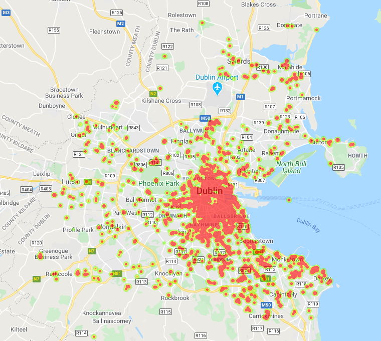
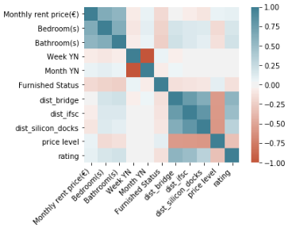
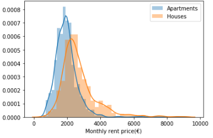
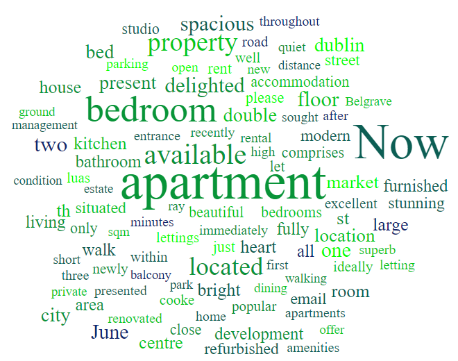

# Rental Prices In Dublin
## Project Overview
- Created a tool that estimates rental prices in Dublin(MAE- €302.68) to help prospective renters negotiate their rental price when applying to rent a property.
- Scraped over 2,500 property descriptions from rent.ie using beautiful soup and selenium.
- Performed in-depth EDA.
- Engineered features using google maps/places  API such as the distance to the city centre and the average rating of restaurants in an area to quantify an area's exclusivity.
- Engineered additional features from the text of each property description
- Optimized Linear, Lasso, Random forest, and Gradient Boosted Regressors using gridsearhCV to reach the best model.

## Table of contents
1. [Background](#background)
2. [Data Collection](#collect)
    1. [Web Scraping](#subparagraph1)
    2. [Engineering Features](#subparagraph2)
3. [EDA](#eda)
4. [Model Building](#model1)
5. [Model Evaluation](#model2)

## Background 
I wanted to understand rental price behaviour in Dublin against various features such as location and the size of the property. My goal was to create a model that predicted the rental price based on such attributes so that I could make a more informed decision, when I try to enter the rental market next year. Rent.ie is Ireland's newest and freshest lettings website offering renters an alternative to the Daft lettings section when looking for rental accommodation and flatshares. They are focused on 18-25 year olds and aim to be the top renting website for this demographic.

## Data Collection 
The data collection notebook can be found [here](notebooks/Data_collection.ipynb)

### 1. Web Scraping 
 I created a scraper tool to scrape over 2,500 property descriptions from rent.ie using python and selenium. With each property, we got the following:
- Listed property price(€)
- Address
- Number of bedrooms
- Number of bathrooms
- Property description
- if the rental price is listed per month
- if the rental price is listed per week
- if the property is furnished or not

### 2. Engineering Features 
Does the location of a property matter that much when renting a house? Many people in Dublin would agree, as driving cars is impractical due to the huge volumes of traffic coming into the city, public transport is not very affordable and biking under windy rain just sucks! Here, I pick three locations O'Connel bridge, IFSC and 'silicon docks'. After this, I found the distance between the location of each property and the revelant point.

How do we measure the effect of trendiness or popularity in a qauntitative way? Popular areas tend to have better amenities  such as resturant's. I choose google places API to get an average review rating of restaurants nearby(1.5km radius) and an average price level. Again, details of how I did this can be found in the notebook above.

In addition, I engineered other features from the text of each property description such as the postcode. Details can be found in the [rent EDA notebook.](notebooks/rent_EDA.ipynb)

Data cleaning also took place. Details of which can be found in the two aforementioned notebooks.

## EDA 
I discovered a number of cool insights. A detailed examination of these insights can be found in the  [EDA notebook.](notebooks/rent_EDA.ipynb)

### Examples:

##### Rental Price Heatmap Of Dublin

#### Correlation Matrix

#### Histograms Of Rental Prices Listed Per Month Or Per Week

#### Wordcloud Of Property Descriptions

## Model Building 

First, I transformed the categorical variables into dummy variables. I also split the data into train and test sets with a test size of 20%.   

I tried four different models and evaluated them using Mean Absolute Error. I chose MAE because it is relatively easy to interpret and outliers aren’t particularly bad in for this type of model.   

I tried four different models:
*	**Multiple Linear Regression** – Baseline for the model
*	**Lasso Regression** – Because of the sparse data from the many categorical variables, I thought a normalized regression like lasso would be effective.
*	**Random Forest** – Again, with the sparsity associated with the data, I thought that this would be a good fit. 
*	**Gradient Boosted Regression** –   GBDT are better learners than Random Forests.

## Model Evaluation 
The Random Forest model far outperformed the other approaches on the training and test sets. 
*	**Multiple Linear Regression** : MAE = 353.42
*	**Lasso Regression**: MAE = 349.80
*	**Random Forest**: MAE = 302.68
*	**Gradient Boosted Regression**: MAE = 325.48

 

